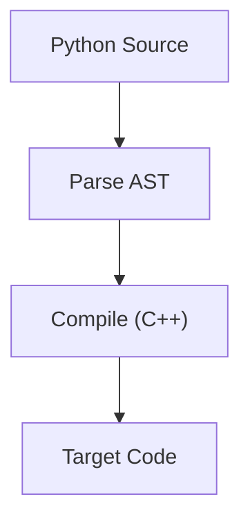
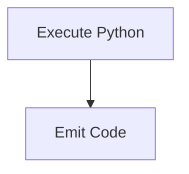
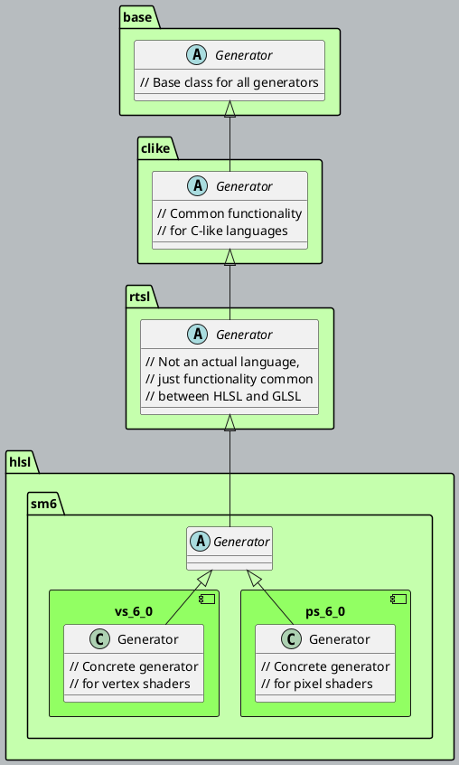
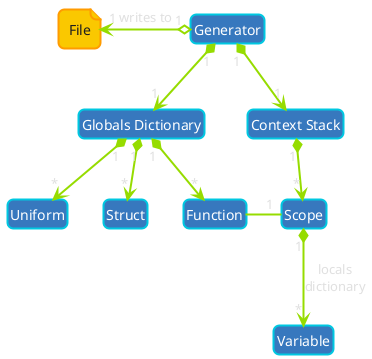
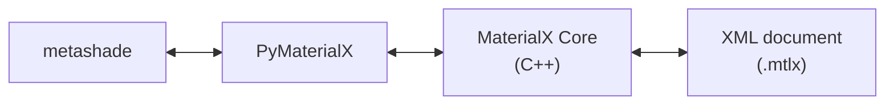

<div class="mt-8">

# <span style="color: #96dc00;">Metashade:</span>
## Compilerless Immediate-Mode <br> Shader Generation <br> in Pure Python

<div class="text-lg mt-6 text-gray-400">Pavlo Penenko</div>

</div>


<div style="position: absolute; left: 24px; bottom: 12px; z-index: 10;">
  
</div>

<!--
Welcome everyone. My name is Pavlo Penenko and I'm going to talk about ... as implemented by my open-source project Metashade.

But first, the fun part: the discaimer.
-->

---

# Disclaimer

<div class="mt-12 max-w-2xl mx-auto text-center text-2xl leading-relaxed" style="color: #ff9b00;">

This presentation is given in my **own personal capacity**.

The views expressed are my own<br>and not those of my employer.

The information presented does not necessarily represent the views of **Autodesk** or its partners.

</div>

<!--
Required employer disclaimer. Keep it brief, read it quickly, move on.

Next up, on a slightly less professional note: my favorite meme - what's a shader?
-->

---

# What's a shader?

<div class="flex items-center justify-center" style="height: 75%;">
  
</div>

<div class="absolute bottom-2 right-4 text-xs opacity-50">
  <a href="https://15462.courses.cs.cmu.edu/fall2023/lectures" target="_blank">Source: CMU 15-462 (Keenan Crane)</a>
</div>

<!--
I thought that before we discuss why anyone would want to generate shaders in Python, it's important to consider what a shader is.

Want to raise arareness of the the multiple problem spaces
and how they overlap - important for understanding the portability concerns.
-->

---

# Shader programming challenges

<div class="grid grid-cols-2 gap-4 mt-4 text-sm">

<div class="p-3 bg-blue-900 bg-opacity-20 rounded-lg">

### 🌐 Portability
Not just between languages, but between apps <br>
- A zoo of languages: <br> WGSL ⟵ HLSL, GLSL, MSL ⟶ OSL, MDL
- Apps have different integration points: e.g. Maya vs UE

</div>

<v-click><div class="p-3 bg-red-900 bg-opacity-20 rounded-lg">

### 💥 Permutation explosion

- Countless shader variants for combinations of material, geometry and light types.
- Fundamentally a design-time problem.

<br>


</div></v-click>

<v-click><div class="p-3 bg-yellow-900 bg-opacity-20 rounded-lg">

### 📐 Low level of abstraction

- Most languages very C-like
- Generic programming lacking

</div></v-click>

<v-click><div class="p-3 bg-green-900 bg-opacity-20 rounded-lg">

### 🧩 Modularity & ♻️ Code reuse
- Includes, linking, modules — non-existent or primitive compared to general-purpose languages
- No "STL for shaders" — lots of manual porting

</div></v-click>

</div>

<v-click at="1">
<div class="absolute bottom-4 right-8">
  
</div>
</v-click>

<!--
* So, why would anyone want to write shaders in Python? Let's examine the challenges.
* Shaders are a spectrum:
   * from browsers, to AAA games, to production pathtracers.
   * GPU and CPU!
   * Graphics and compute
   * same material for pathtracing, viewports or visual profduction
* GPU shaders are simple, but we need lots of them
-->

---
layout: two-cols-header
layoutClass: gap-4
---

# Where I'm coming from

::left::

<div class="mt-4 text-lg leading-relaxed">

- A decade in game dev (Capcom et al)
- ISV and VR work at AMD
- DCC dev: SideFX, Maxon (Redshift RT), Autodesk (Maya Viewport)
- Currently Principal SWE at Autodesk:  shared visualization tech, MaterialX, Hydra
- Mostly a C++ programmer by day, specializing in shader pipelines
- But Python is super popular in VFX pipelines!

</div>

::right::

<div class="flex justify-center items-center h-full">
  
</div>

<!--
How do I know that the pain is real? I've been working with shaders for a couple of decades.

A decade in games (Capcom etc.), VR at AMD, Houdini Engine at SideFX, Maya VP at Autodesk.

Currently working on MaterialX and Hydra at Autodesk. OSS and internal visualization tech.
Metashade grew out of years of that frustration.
-->

---

# Existing solutions

<div class="grid grid-cols-[1fr_1.2fr] gap-x-4 gap-y-0 mt-2 items-start text-sm">

<!-- Row 1: Preprocessor -->
<div>

**The С Preprocessor** (Übershaders) <br>
<span class="text-gray-400">Primitive text substitution</span>

</div>
<div>

```c
#ifdef HAS_NORMAL
    float3 ng = normalize(Input.Normal);
#else
    float3 ng = cross(pos_dx, pos_dy);
#endif
```

</div>

<!-- Row 2: Generics -->
<v-click at="1"><div>

**Generics / Templates** <br>
<span class="text-gray-400">Vary wildly across languages</span>

</div></v-click>
<v-click at="1"><div class="text-gray-400">
<br>

- C++ templates in HLSL 2021
- Slang invented its own generics
- Nothing in GLSL

</div></v-click>

<!-- Row 3: Microshaders -->
<v-click at="2"><div>

**Microshader frameworks** <br>
<span class="text-gray-400">Visual graph editors in particular</span>

</div></v-click>
<v-click at="2"><div class="text-gray-400">

Unreal Material Graph, Maya Hypershade, MaterialX

</div></v-click>

<!-- Row 4: Transpiling -->
<v-click at="3"><div>

**Transpiling** <br>
<span class="text-gray-400">State of the art for portability</span>

</div></v-click>
<v-click at="3"><div class="text-gray-400">

SPIRV-Cross, Slang, Tint (WebGPU)

</div></v-click>

</div>

<!--
In real-world apps, more than one approach is often used. The preprocessor is ancient but ubiquitous. Generics are the modern answer but fragmented. Visual graphs are great for artists but don't scale for complex logic. Transpiling solves portability but loses information (macros, comments, includes). EDSLs are the frontier.
-->

---
layout: two-cols-header
layoutClass: gap-4
---

# Pythonic GPU EDSLs

::left::

- EDSL = Embedded Domain-specific Language
- [Warp](https://github.com/NVIDIA/warp), [Taichi](https://github.com/taichi-dev/taichi), [Numba](https://github.com/numba/numba), [Triton](https://github.com/triton-lang/triton)
- Function decorators
- Python AST is transpiled to the target
   - Pythonic syntax
   - But only a **subset** of Python
   - Can't mix design-time and run-time code
- Only compute targets, not graphics

::right::

### From Warp docs

```python
@wp.kernel
def simple_kernel(a: wp.array(dtype=wp.vec3),
                  b: wp.array(dtype=wp.vec3),
                  c: wp.array(dtype=float)):

```


<!--
TODO: Reformat with more source?

Let's talk about the existing Pythonic GPU EDSLs. Warp, Taichi, Numba, Triton — all excellent projects. They all follow the same architecture. A decorator captures the function. Introspection extracts the AST or bytecode. Then a compiler — typically implemented in C++ — transforms it to the target code.
-->

---
layout: two-cols-header
layoutClass: gap-4
---

# Metashade - Hello World

::left::

- https://github.com/metashade/metashade
- Apache 2.0
- `pip install metashade`
- Not an Autodesk project!

::right::

```python
@export
def D_Ggx(sh, NdotH: 'Float', fAlphaRoughness: 'Float') -> 'Float':
    """
    GGX/Trowbridge-Reitz Normal Distribution Function.
    """
    sh.fASqr = fAlphaRoughness * fAlphaRoughness
    sh.fF = (NdotH * sh.fASqr - NdotH) * NdotH + sh.Float(1.0)
    sh.return_(
        (sh.fASqr / (sh.Float(math.pi) * sh.fF * sh.fF)).saturate()
    )
```

<v-click>

<div class="flex justify-center my-1">
  <div style="
    width: 40%;
    height: 36px;
    background: #96dc00;
    color: #1e1e1e;
    clip-path: polygon(30% 0, 70% 0, 70% 50%, 100% 50%, 50% 100%, 0% 50%, 30% 50%);
    display: flex;
    align-items: flex-start;
    justify-content: center;
    padding-top: 2px;
    font-weight: 700;
    font-size: 11px;
    letter-spacing: 0.05em;
  ">GENERATES</div>
</div>

```hlsl
// GGX/Trowbridge-Reitz Normal Distribution Function.
float D_Ggx(float NdotH, float fAlphaRoughness)
{
	float fASqr = fAlphaRoughness * fAlphaRoughness;
	float fF = (((NdotH * fASqr) - NdotH) * NdotH) + 1.0;
	return saturate(fASqr / ((3.141592653589793 * fF) * fF));
}
```

</v-click>

<style>
.two-columns { grid-template-columns: 1fr 2fr !important; }
</style>

---
layout: two-cols-header
layoutClass: gap-4
---

# glTF PBR Demo

[metashade/metashade-glTFSample](https://github.com/metashade/metashade-glTFSample)

::left::

- Based on AMD's Cauldron
- Parses glTF assets with `pygltflib`
- Rasterization with DirectX 12
- Replaces übershaders
- Meat-and-potatoes glTF PBR shading
- Obligatory DamagedHelmet.gltf

::right::


<!--
Here's the proof that this actually works for real rendering. The glTF demo parses actual glTF assets using pygltflib — a completely standard Python library — and generates material-specific pixel shaders. No übershaders, no #ifdefs. Each material gets exactly the shader it needs.

Notice the plain Python if statement. This runs at design time — during generation. It checks whether the glTF mesh has tangent data, and conditionally generates the tangent-space code. This kind of interleaving — reading asset data and generating code in the same Python function — is simply impossible with an AST-based EDSL.
-->

---
title: Design Principles
---

# Design Principles

<div class="grid grid-cols-2 gap-x-6 mt-2 items-start text-sm">

<div>

### Tracing, not introspection

- Like **JAX** / **PyTorch**: trace execution with proxy objects
- Not parsing the Python AST
- Python's interpreter *is* the code generator
- → **100% Python** implementation

<v-click>

<div class="mt-6">

### Immediate mode codegen

- Similar to **PyTorch Eager Mode** launching computations eagerly, generate code one statement at a time
- Generate readable source directly, instead of an IR
- Interleave codegen with arbitrary Python code
- → Integrate into anything, without asking for permission

</div>

</v-click>

</div>

<v-click>

<div class="grid grid-cols-2 gap-2 mt-2 text-center text-xs">

<div>

### Warp / Taichi
<br>



</div>

<div>

### Metashade
<br>



</div>

</div>

</v-click>

</div>

<!--
If you're from the ML world, these analogies will click. We trace like JAX — proxy objects record operations instead of performing them. And we emit eagerly like PyTorch Eager Mode — one line at a time, no intermediate representation. There's no separate compilation step. Python's interpreter IS the code generator.

The key consequence: because we just execute Python, you get full Python at design time, standard debugging, and the ability to call any Python library during generation. You can integrate into anything — no runtime host code necessary, any shader stage or kernel, generate source not an IR, and you can implement only parts of your system with Metashade. The ability to interleave codegen with arbitrary Python code lets you leverage the ecosystem, integrate with pipelines, and easily build custom abstractions on top of basic codegen.
-->

---
layout: two-cols
layoutClass: gap-4
---

# Metashade Generators

::left::

All codegen happens via a polymorphic generator object, representing the concrete target. Named `sh` by convention!

```python
from metashade.targets.hlsl.sm6 import ps_6_0
from metashade.targets.glsl import frag

def generate(sh):
    # Polymorphic shader code for multiple targets
    pass

with open('ps.hlsl', 'w') as ps_file:
    sh = ps_6_0.Generator(ps_file)
    generate(sh)

with open('fs.glsl', 'w') as frag_file:
    sh = frag.Generator(frag_file)
    generate(sh)
```

::right::
<div class="transform scale-[0.7] origin-top -mt-4 p-4 rounded-lg" style="background: #b7bcbf;">


</div>

---
layout: two-cols-header
layoutClass: gap-4
---

# Anatomy of a generator

::left::

<div class="mt-4 text-lg leading-relaxed">

- A generator acts as a **semantic model** of the shader being generated
- Emulates C-like scopes
- EDSL syntax interacts with this model at runtime and emits target code one statement at a time to a **File**

</div>

::right::

<div class="-mt-4">



</div>

---
title: Capturing Symbols
---

# Capturing Symbols

<div class="text-sm mt-2" style="line-height: 1.4;">

- How to capture a variable's *name* without introspection?
- How to overload assignment to C-like assignment by value?

</div>

<div class="grid grid-cols-[1fr_1.2fr] gap-x-4 gap-y-0 mt-1 items-start text-sm">

<!-- Row 1: Solution + basic snippet -->
<v-click at="1"><div>

**Solution:** make variables attributes on the generator!
- `__setattr__` intercepts assignment
- `__getattr__` returns a tracer

</div></v-click>
<v-click at="1"><div>

```python
# Variable definition:
sh.x = sh.Float(1.0)
# → emits: float x = 1.0;
```

</div></v-click>

<!-- Row 2: Lifetime -->
<v-click at="2"><div>

The generator enforces **lifetime**:

</div></v-click>
<v-click at="2"><div>

```python
with sh.if_(cond):
    sh.y = sh.Float(2.0)
sh.z = sh.y  # ❌ Exception: out of scope
```

</div></v-click>

<!-- Row 3: Static typing -->
<v-click at="3"><div>

...and **static typing**:

</div></v-click>
<v-click at="3"><div>

```python
sh.x = sh.Float(1.0)
sh.x = sh.Float3(1, 2, 3)  # ❌ Exception: type mismatch
```

</div></v-click>

<!-- Row 4: Separate namespaces -->
<v-click at="4"><div>

Separate namespaces — no collision:

</div></v-click>
<v-click at="4"><div>

```python
texture = "base"                  # Python variable
sh.texture = get_texture(texture) # shader variable
```

</div></v-click>

</div>

<!--
Arguably, the most important pattern. In Python, unlike in C++, you can't overload assignment — it's a statement, not an expression. But you CAN overload attribute access. 

The beautiful consequence: regular Python variables and shader meta-variables coexist with zero collision. Python variables are for your design-time logic — reading files, computing parameters, looping over materials. Generator attributes are for the shader code you're generating.
-->

---
title: Operator Overloading
---

# Operator Overloading

<div class="text-sm mt-2" style="line-height: 1.4;">

Tracer objects record math operations instead of performing them:

```python
def __add__(self, other):
    return Expression(f"({self} + {other})")
```

</div>

<div class="grid grid-cols-[0.8fr_1fr_1fr] gap-x-3 gap-y-0 mt-1 items-start text-sm">

<!-- Header -->
<div class="font-bold text-gray-400"></div>
<v-click at="1"><div class="font-bold text-gray-400">Python</div></v-click>
<v-click at="1"><div class="font-bold text-gray-400">HLSL</div></v-click>

<!-- Row 1: Arithmetic -->
<v-click at="1"><div>

`+`, `-`, `*` build expressions

</div></v-click>
<v-click at="1"><div>

```python
sh.diffuse = sh.albedo * sh.NdotL
```

</div></v-click>
<v-click at="1"><div>

```hlsl
float3 diffuse = albedo * NdotL;
```

</div></v-click>

<!-- Row 2: @ operator -->
<v-click at="2"><div>

`@` → **dot product**

</div></v-click>
<v-click at="2"><div>

```python
sh.NdotL = sh.N @ sh.L
```

</div></v-click>
<v-click at="2"><div>

```hlsl
float NdotL = dot(N, L);
```

</div></v-click>

<!-- Row 3: // operator -->
<v-click at="3"><div>

```python
def __floordiv__(self, comment):
    self._single_line_comment(comment)
```

</div></v-click>
<v-click at="3"><div>

```python
sh // 'Diffuse contribution'
```

</div></v-click>
<v-click at="3"><div>

```hlsl
// Diffuse contribution
```

</div></v-click>

<!-- Row 4: Semantic types -->
<v-click at="4"><div>

**Semantic type safety** -<br>stronger than the target language

</div></v-click>
<v-click at="4"><div>

```python
sh.RgbF(1,0,0) + sh.Point3f(1,2,3)
```

</div></v-click>
<v-click at="4"><div>

```
❌ Exception: can't add color to point
   (both are float3 in HLSL!)
```

</div></v-click>

</div>

<!--
Operator overloading is the most straightforward pattern. Tracer objects record math instead of performing it. Python 3's @ operator maps perfectly to dot product — probably the most satisfying operator overload I've written. Floor division — double slash — becomes a comment in the output. And because we have our own type wrappers, we get semantic type checking that the target language doesn't have. You can't accidentally add a color to a point, even though they're both float3 in HLSL.
-->

<!--
* Operator overloading to capture expressions.
   * Tracer objects record math operations instead of performing them.
   * Tracer objects are strongly typed and can enforce semantics better than the target language.
-->
---
title: Representing data types
---

# Representing data types

<div class="grid grid-cols-2 gap-x-6 mt-2 items-start text-sm">

<div>

- Not mapping Python types to target types 
- Data types are polymorphic **tracer objects**
- Data type's logic is encapsulated in its class:
   - What operations, intrinsics and conversions are defined
- Define your own, with custom semantics, all in Python!
   - E.g.: color spaces, radiometric units
<v-click at="1">
- Polymorphic across targets
</v-click>

</div>

<div>

```python
class ArithmeticType(BaseType):
    # ...
    def __add__(self, rhs):
        return self._rhs_binary_operator(rhs, '+')

    def __iadd__(self, rhs):
        return self._inplace_binary_operator(rhs, '+')

    def __sub__(self, rhs):
        return self._rhs_binary_operator(rhs, '-')
```

</div>

</div>

<v-click at="1">

```python
sh.baseColor = sh.RgbF(1.0, 0.0, 0.0)
```

</v-click>

<div class="grid grid-cols-3 gap-4 mt-2">
<v-click at="2"><div>

```hlsl
// HLSL
float3 baseColor =
  float3(1.0, 0.0, 0.0);
```

</div></v-click>
<v-click at="2"><div>

```glsl
// GLSL
vec3 baseColor =
  vec3(1.0, 0.0, 0.0);
```

</div></v-click>
<v-click at="2"><div>

```c
// OSL (future)
color baseColor =
  color(1.0, 0.0, 0.0);
```

</div></v-click>
</div>

<!--
Types are accessed through the generator, making them polymorphic by target. sh.RgbF means "an RGB color as float" conceptually — but what it maps to depends entirely on which generator you're using. In HLSL it's float3, in GLSL it's vec3, in OSL it would be the color type. And because we have our own type wrappers around the target types, we get stronger semantic typing than any individual shading language provides.
-->


---
layout: two-cols-header
layoutClass: gap-4
---

# More examples

::left::

### Python

```python {1|3-5|7|9|11|13-16}{at:1}
sh.rgba = sh.RgbaF(rgb = (0, 1, 0), a = 0)

# Swizzling - the destination type is deduced
# a la `auto` in C++
sh.color = sh.rgba.rgb

sh.color.r = 1 # write masking

sh.N = sh.N.normalize() # intrinsic

sh.NdotL = sh.N @ sh.L  # Dot product == Python 3 matmul

# Also used to combine textures and samplers
combined_sampler = sh.g_tColor @ sh.g_sColor

sh.rgbaSample = combined_sampler(sh.uv)
```

::right::

### HLSL

```hlsl {1|3-5|7|9|11|13-16}{at:1}
float4 rgba = float4(float3(0, 1, 0), 0);


float3 color = rgba.rgb;

color.r = 1;

N = normalize(N);

float NdotL = dot(N, L);


float4 rgbaSample = g_tColor.Sample(g_sColor, uv);
```

---

# Emulating C-like Scopes

<div style="opacity: 1 !important;">

Problem: C-like languages create scopes where Python doesn’t

<div class="grid grid-cols-2 gap-6 mt-2">

<div>

### Python

```python
if True:
    x = 1
print(x)    # ✅ OK
```

</div>

<div>

### C-like languges

```c
if (true) {
    int x = 0;
}
std::cout << x << std::endl;    // ❌ Compilation Error
```

</div>

</div>

</div>

<v-click>

Solution: context managers + runtime scope emulation in the generator

<div class="grid grid-cols-2 gap-6">

<div>

```python
with sh.if_(sh.NdotL > sh.Float(0)):
    sh.diffuse = sh.albedo * sh.NdotL
with sh.else_():
    sh.diffuse = sh.RgbF(0, 0, 0)
```

</div>

<div>

```hlsl
if (NdotL > 0)
{
    diffuse = albedo * NdotL;
}
else
{
    diffuse = float3(0, 0, 0);
}
```

</div>

</div>

</v-click>

<style>
.slidev-vclick-target.slidev-vclick-prior {
  opacity: 1 !important;
}
</style>

<!--
Python doesn't have block scoping — variables leak out of if/for/while. C-family languages scope variables to curly-brace blocks. The solution: Python's context managers. `with` gives us __enter__ and __exit__ — __enter__ emits the opening brace and pushes a scope onto the generator's context stack, __exit__ pops it and emits the closing brace. The same pattern works for functions, for-loops, struct declarations — anything with braces in the target language.
-->

<!--
* Context managers to simulate C-like scopes.
   * The differences between the two and how to work around them.
-->

---
title: Design-Time vs. Run-Time
---

# Design-Time vs. Run-Time

Explicit separation enables mixing of design-time and run-time logic.

<div class="grid grid-cols-2 gap-6 mt-4">

<div>

### Python `if` → Design-time

- Like `#ifdef` / `if constexpr` in C++
- Evaluated during generation
- Conditional code generation

```python
# Tangent space: only if the mesh has tangents
if hasattr(sh.vsIn, 'Tobj'):
    sh.vsOut.Tw = sh.g_WorldXf.xform(
        sh.vsIn.Tobj.xyz).xyz.normalize()
    sh.vsOut.Bw = sh.vsOut.Nw.cross(
        sh.vsOut.Tw) * sh.vsIn.Tobj.w
```

</div>

<div v-click>

### `sh.if_()` → Run-time

Generates a conditional in the target shader

#### Python
```python
# Generates a shader if-statement
with sh.if_(sh.NdotL > sh.Float(0)):
    sh.diffuse = sh.albedo * sh.NdotL
```

#### HLSL
```hlsl
if (NdotL > 0)
{
    diffuse = albedo * NdotL;
}
```

</div>

</div>


<!--
And HERE is the real power of the architecture. Plain Python if/else becomes your design-time conditional — the equivalent of #ifdef or if constexpr. It runs during generation and only the true branch produces code. Metashade's with sh.if_() generates a runtime conditional in the target shader. The separation is completely explicit and natural. No annotations, no special macro language. Design-time is Python's runtime. Run-time is the generated code's runtime.
-->

---

# Function definition syntax

<div class="grid grid-cols-[1fr_2.2fr] gap-x-8 gap-y-1 mt-4 items-center">

<!-- Row 1: Context Manager -->
<v-click at="1"><div>

### Context Manager
- Immediate mode
- Dynamic

</div></v-click>

<v-click at="1"><div>

```python
with sh.function('D_Ggx', sh.Float)(
    NdotH = sh.Float, fAlphaRoughness = sh.Float
):
    sh.fASqr = sh.fAlphaRoughness * sh.fAlphaRoughness
    sh.fF = (sh.NdotH * sh.fASqr - sh.NdotH) * sh.NdotH + sh.Float(1.0)
    sh.return_((sh.fASqr / (sh.Float(math.pi) * sh.fF * sh.fF )).saturate())
```

</div></v-click>

<!-- Row 2: Decorator -->
<v-click at="2"><div class="mt-4">

### Decorator
- Pythonic syntax
- Using introspection
- Acquired at Python import
- Body generated with `sh.instantiate`

</div></v-click>

<v-click at="2"><div class="mt-4">

```python
@export
def D_Ggx(sh, NdotH: 'Float', fAlphaRoughness: 'Float') -> 'Float':
    """
    GGX/Trowbridge-Reitz Normal Distribution Function.
    """
    sh.fASqr = fAlphaRoughness * fAlphaRoughness
    sh.fF = (NdotH * sh.fASqr - NdotH) * NdotH + sh.Float(1.0)
    sh.return_((sh.fASqr / (sh.Float(math.pi) * sh.fF * sh.fF)).saturate())
```

</div></v-click>

</div>

---

# Metaprogramming example

<div class="grid grid-cols-[1fr_2.2fr] gap-x-8 mt-4 items-start">

<div class="text-sm leading-relaxed">

From [metashade-glTFSample](https://github.com/metashade/metashade-glTFSample)

- Automates texture sampling based on **glTF asset contents** parsed with 3rd-party [`pygltflib`](https://pypi.org/project/pygltflib/)
- `if` checks at design time
- `getattr` / `setattr` dynamically construct uniform and variable names
- Python metaprogramming replaces `#ifdef`s
- Not possible with just Python introspection!


</div>

<div>

```python
def _sample_material_texture(texture_name: str):
    uv = _get_material_uv(texture_name)
    if uv is None:
        return None  # Not used — no code emitted

    # Get uniforms by glTF texture name
    texture = getattr(sh, _get_texture_uniform_name(texture_name))
    sampler = getattr(sh, _get_sampler_uniform_name(texture_name))

    # Generate the sampling expression
    sample = (sampler @ texture)(uv, lod_bias=sh.g_lodBias)

    # Create a unique variable name
    sample_var_name = texture_name + 'Sample'
    setattr(sh, sample_var_name, sample)

    return getattr(sh, sample_var_name)
```

</div>

</div>

<!--
- The real payoff of the architecture. Takes a glTF texture name, checks if the material actually uses it, and if so, generates the sampling code.
- Demonstrates intergation with external Python code, executed in the midst of codegen.
- Plain Python metaprogramming driving shader generation — and it simply wouldn't work in a system that parses the AST, because getattr and setattr aren't in the supported subset.
-->

---

# Example integration: MaterialX

<div class="grid grid-cols-2 gap-x-6 mt-2 items-start">

<div class="text-sm" style="line-height: 1.5;">

[**MaterialX**](https://materialx.org/) — industry-standard open-source material framework (ASWF)

- Implemented in C++, serialized as XML
- Python API: **PyMaterialX**
- Used by Maya, Houdini, USD, Blender...

<v-click>

Example: **OpenPBR Surface** tests the limits of visual programming

</v-click>

<v-click>

#### `metashade.mtlx`

- generates GLSL source code
- interacts with PyMaterialX for bi-directional integration
- Metashade and MaterialX can call each other
- resulting nodes are **standard MaterialX**

</v-click>

</div>

<div>


<v-click at="2">

<div class="mt-12">



</div>

</v-click>

</div>

</div>

<!--
MaterialX is the industry-standard open-source material framework, developed by the Academy Software Foundation. It's implemented in C++, serialized as XML, but like any serious piece of VFX software, has a Python API — PyMaterialX.

The screenshot shows OpenPBR Surface — the most complex standardized surface model. As a MaterialX visual graph, it's hundreds of interconnected nodes. Hard to read, hard to maintain, hard to onboard new engineers onto.

Metashade's mtlx package leverages PyMaterialX to programmatically create MaterialX nodedef documents and implementation documents, while simultaneously generating the GLSL source code. The result is standard MaterialX nodes that any DCC — Maya, Houdini, USD — can load and render.

The key insight is that the same @export decorator that captures the function signature for Metashade's code generation also provides the reflection data needed to auto-generate the MaterialX nodedef with correct input/output types. One function definition produces both the shader source AND the XML metadata.
-->

---
layout: center
class: text-center
---

# Thank You!

<div class="mt-8 flex items-center justify-center gap-8 max-w-2xl mx-auto">


<div class="text-left text-lg leading-relaxed">

🔗 [github.com/metashade/metashade](https://github.com/metashade/metashade)

🔗 [metashade-glTFSample](https://github.com/metashade/metashade-glTFSample)

📦 `pip install metashade`

</div>

</div>

<div class="mt-8 text-2xl text-gray-300 font-light">

Questions?

</div>

<div style="position: absolute; left: 24px; bottom: 12px; z-index: 10;">
  
</div>

<!--
The key takeaway goes beyond GPU shaders. These Python metaprogramming patterns — operator overloading, __getattr__/__setattr__, context managers, decorators — can be applied to any domain where you need to generate code in another language. SQL, IaC, protocol buffers — the same techniques. If you're building an EDSL in Python, you don't need a compiler. Sometimes, you can just run Python.

Thank you! The library is on PyPI. I'd love your questions — especially if you're building EDSLs of your own.
-->
